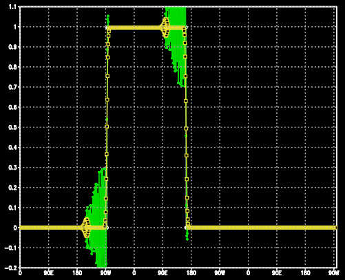

# Modelagem Numérica da Atmosfera - Exercício 2

### Vinicius Roggério da Rocha

Implementação do esquema de discretização de Runge-Kutta de 2ª, 4ª e 6ª ordem
em Fortran 90 e comparação dos resultados ao aproximar numericamente a
resolução de uma onda quadrada.

O script EDP_AdvTime.f90 define a variável "scheme" com uma sigla que chama
a função que discretiza a equação conforme a ordem do método de Runge-Kutta
(RK2, RK4 ou RK6), que recebe o parâmetro indicando se deve ser centrado no
espaço de 2ª ordem (CS), centrado no espaço 4ª ordem (CS4) ou avançado no
espaço de 1ª ordem 'UpwindSpace' (FS).

Comandos utilizados (exceto renomear arquivos bin e ctl, alterando referência):  
`$ gfortran EDP_AdvTime.f90;  
$ ./a.out;  
$ grads;  
ga-> open RK2CS.ctl;  
ga-> q file;  
ga-> open RK4CS4.ctl;  
ga-> q file;  
ga-> set t 50;  
ga-> d ua;  
ga-> d uc.1;  
ga-> d uc.2`  

  
*Amplitude da onda quadrada com a solução analítica em branco, a solução de
2ª ordem em verde e a solução de 4ª ordem em amarelo (RK2CS4 e RK4CS4)*

Observa-se que, ao aumentar a ordem de diferenciação, a precisão aumenta, já
que a amplitude dos artefatos numéricos gerados pela discretização diminuem,
aproximando o resultado da solução analítica.
